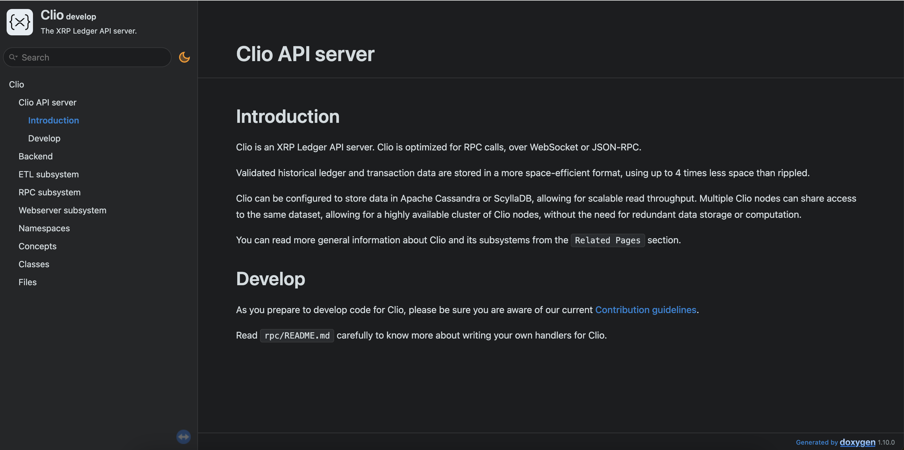

# How to build Clio

`Clio` is built with [CMake](https://cmake.org/) and uses [Conan](https://conan.io/) for managing dependencies.
`Clio` is written in C++23 and therefore requires a modern compiler.

## Minimum Requirements

- [Python 3.7](https://www.python.org/downloads/)
- [Conan 2.20.1](https://conan.io/downloads.html)
- [CMake 3.20](https://cmake.org/download/)
- [**Optional**] [GCovr](https://gcc.gnu.org/onlinedocs/gcc/Gcov.html): needed for code coverage generation
- [**Optional**] [CCache](https://ccache.dev/): speeds up compilation if you are going to compile Clio often

We use our Docker image `ghcr.io/XRPLF/clio-ci` to build `Clio`, see [Building Clio with Docker](#building-clio-with-docker).
You can find information about exact compiler versions and tools in the [image's README](https://github.com/XRPLF/clio/blob/develop/docker/ci/README.md).

The following compiler version are guaranteed to work.
Any compiler with lower version may not be able to build Clio:

| Compiler    | Version |
| ----------- | ------- |
| GCC         | 15.2    |
| Clang       | 19      |
| Apple Clang | 17      |

### Conan Configuration

By default, Conan uses `~/.conan2` as it's home folder.
You can change it by using `$CONAN_HOME` env variable.
[More info about Conan home](https://docs.conan.io/2/reference/environment.html#conan-home).

> [!TIP]
> To setup Conan automatically, you can run `.github/scripts/conan/init.sh`.
> This will delete Conan home directory (if it exists), set up profiles and add Artifactory remote.

The instruction below assumes that `$CONAN_HOME` is not set.

#### Profiles

The default profile is the file in `~/.conan2/profiles/default`.

Here are some examples of possible profiles:

**Mac apple-clang 17 example**:

```text
[settings]
arch={{detect_api.detect_arch()}}
build_type=Release
compiler=apple-clang
compiler.cppstd=20
compiler.libcxx=libc++
compiler.version=17
os=Macos

[conf]
grpc/1.50.1:tools.build:cxxflags+=["-Wno-missing-template-arg-list-after-template-kw"]
```

**Linux gcc-12 example**:

```text
[settings]
arch={{detect_api.detect_arch()}}
build_type=Release
compiler=gcc
compiler.cppstd=20
compiler.libcxx=libstdc++11
compiler.version=12
os=Linux

[conf]
tools.build:compiler_executables={"c": "/usr/bin/gcc-12", "cpp": "/usr/bin/g++-12"}
```

> [!NOTE]
> Although Clio is built using C++23, it's required to set `compiler.cppstd=20` in your profile for the time being as some of Clio's dependencies are not yet capable of building under C++23.

#### global.conf file

To increase the speed of downloading and uploading packages, add the following to the `~/.conan2/global.conf` file:

```text
core.download:parallel={{os.cpu_count()}}
core.upload:parallel={{os.cpu_count()}}
```

#### Artifactory

Make sure artifactory is setup with Conan.

```sh
conan remote add --index 0 xrplf https://conan.ripplex.io
```

Now you should be able to download the prebuilt dependencies (including `xrpl` package) on supported platforms.

#### Conan lockfile

To achieve reproducible dependencies, we use [Conan lockfile](https://docs.conan.io/2/tutorial/versioning/lockfiles.html).

The `conan.lock` file in the repository contains a "snapshot" of the current dependencies.
It is implicitly used when running `conan` commands, you don't need to specify it.

You have to update this file every time you add a new dependency or change a revision or version of an existing dependency.

To do that, run the following command in the repository root:

```bash
conan lock create .
```

## Building Clio

1. Navigate to Clio's root directory and run:

   ```sh
   mkdir build && cd build
   ```

2. Install dependencies through conan

   ```sh
   conan install .. --output-folder . --build missing --settings build_type=Release
   ```

   > You can add `--profile:all <PROFILE_NAME>` to choose a specific conan profile.

3. Configure and generate build files with CMake

   ```sh
   cmake -DCMAKE_TOOLCHAIN_FILE:FILEPATH=build/generators/conan_toolchain.cmake -DCMAKE_BUILD_TYPE=Release    ..
   ```

   > You can add `-GNinja` to use the Ninja build system (instead of Make).

4. Now, you can build all targets or specific ones:

   ```sh
   # builds all targets
   cmake --build . --parallel 8
   # builds only clio_server target
   cmake --build . --parallel 8 --target clio_server
   ```

   You should see `clio_server` and `clio_tests` in the current directory.

> [!NOTE]
> If you've built Clio before and the build is now failing, it's likely due to updated dependencies. Try deleting the build folder and then rerunning the Conan and CMake commands mentioned above.

### CMake options

There are several CMake options you can use to customize the build:

| CMake Option          | Default | CMake Target             | Description                           |
| --------------------- | ------- | ------------------------ | ------------------------------------- |
| `-Dcoverage`          | OFF     | `clio_tests-ccov`        | Enables code coverage generation      |
| `-Dtests`             | OFF     | `clio_tests`             | Enables unit tests                    |
| `-Dintegration_tests` | OFF     | `clio_integration_tests` | Enables integration tests             |
| `-Dbenchmark`         | OFF     | `clio_benchmark`         | Enables benchmark executable          |
| `-Ddocs`              | OFF     | `docs`                   | Enables API documentation generation  |
| `-Dlint`              | OFF     | See #clang-tidy          | Enables `clang-tidy` static analysis  |
| `-Dsan`               | N/A     | N/A                      | Enables Sanitizer (asan, tsan, ubsan) |
| `-Dpackage`           | OFF     | N/A                      | Creates a debian package              |

### Generating API docs for Clio

The API documentation for Clio is generated by [Doxygen](https://www.doxygen.nl/index.html). If you want to generate the API documentation when building Clio, make sure to install Doxygen 1.12.0 on your system.

To generate the API docs, please use CMake option `-Ddocs=ON` as described above and build the `docs` target.

To view the generated files, go to `build/docs/html`.
Open the `index.html` file in your browser to see the documentation pages.



## Building Clio with Docker

It is also possible to build Clio using [Docker](https://www.docker.com/) if you don't want to install all the dependencies on your machine.

```sh
docker run -it ghcr.io/xrplf/clio-ci:384e79cd32f5f6c0ab9be3a1122ead41c5a7e67d
git clone https://github.com/XRPLF/clio
cd clio
```

And then follow the same steps as in [Building Clio](#building-clio), use `--profile:all gcc` or `--profile:all clang` with `conan install` command to choose the desired compiler.

## Developing against `rippled` in standalone mode

If you wish to develop against a `rippled` instance running in standalone mode there are a few quirks of both Clio and `rippled` that you need to keep in mind. You must:

1. Advance the `rippled` ledger to at least ledger 256.
2. Wait 10 minutes before first starting Clio against this standalone node.

## Building with a Custom `libxrpl`

Sometimes, during development, you need to build against a custom version of `libxrpl`. (For example, you may be developing compatibility for a proposed amendment that is not yet merged to the main `rippled` codebase.) To build Clio with compatibility for a custom fork or branch of `rippled`, follow these steps:

1. First, pull/clone the appropriate `rippled` version and switch to the branch you want to build.
   The following example uses a `2.5.0-rc1` tag of rippled in the main branch:

   ```sh
   git clone https://github.com/XRPLF/rippled/
   cd rippled
   git checkout 2.5.0-rc1
   ```

2. Export a custom package to your local Conan store using a user/channel:

   ```sh
   conan export . --user=my --channel=feature
   ```

3. Patch your local Clio build to use the right package.

   Edit `conanfile.py` in the Clio repository root. Replace the `xrpl` requirement with the custom package version from the previous step. This must also include the current version number from your `rippled` branch. For example:

   ```py
   # ... (excerpt from conanfile.py)
   requires = [
       'boost/1.83.0',
       'cassandra-cpp-driver/2.17.0',
       'fmt/10.1.1',
       'protobuf/3.21.9',
       'grpc/1.50.1',
       'openssl/1.1.1v',
       'xrpl/2.5.0-rc1@my/feature', # Use your exported version here
       'zlib/1.3.1',
       'libbacktrace/cci.20210118'
   ]
   ```

4. Build Clio as you would have before.

   See [Building Clio](#building-clio) for details.

## Using `clang-tidy` for static analysis {#clang-tidy}

Clang-tidy can be run by CMake when building the project.
To achieve this, you just need to provide the option `-Dlint=ON` when generating CMake files:

```sh
cmake -DCMAKE_TOOLCHAIN_FILE:FILEPATH=build/generators/conan_toolchain.cmake -DCMAKE_BUILD_TYPE=Release -Dlint=ON ..
```

By default CMake will try to find `clang-tidy` automatically in your system.
To force CMake to use your desired binary, set the `CLIO_CLANG_TIDY_BIN` environment variable to the path of the `clang-tidy` binary. For example:

```sh
export CLIO_CLANG_TIDY_BIN=/opt/homebrew/opt/llvm/bin/clang-tidy
```
